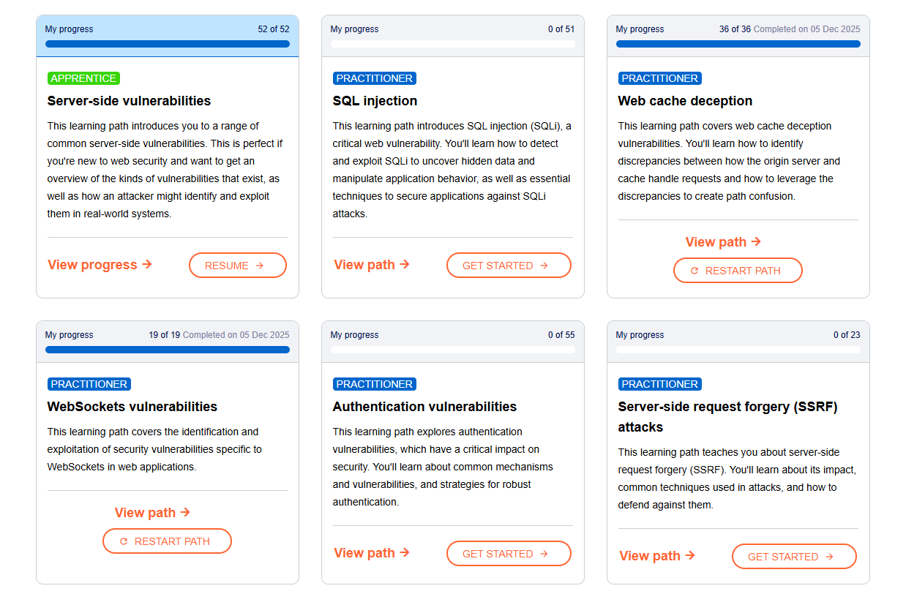

# Зачет

Задание лежит в папке java-test/task
Видео к нему лежит в папке java-test/task/video

# Задачи

1. Задача на список в папке List
2. Вывод погоды через API в папке wheater-app
3. Задача на алгоритм Монте Карло в папке MonteCarlo
4. Задача с запросами в папке handlers
5. Задача на граф в папке graph

# Скрины пройденных курсов

